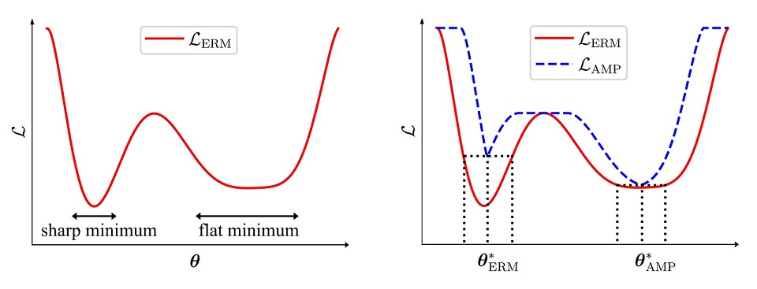

# AMP-Regularizer


A PyTorch implementation for our CVPR 2021 paper "Regularizing Neural Networks via Adversarial Model Perturbation".

You can download the paper via: [[ArXiv]](https://arxiv.org/abs/2010.04925) [[PapersWithCode]](https://paperswithcode.com/paper/regularizing-neural-networks-via-adversarial).

Poster and Slides can be found [here](https://github.com/hiyouga/AMP-Poster-Slides-LaTeX).

## One-Sentence Summary

Adversarial Model Perturbation (AMP) effectively improves the generalization performance of deep models by minimizing an "AMP loss" that can find flat local minima via applying a "worst" norm-bounded perturbation on the model parameter.



## Abstract

Effective regularization techniques are highly desired in deep learning for alleviating overfitting and improving generalization. This work proposes a new regularization scheme, based on the understanding that the flat local minima of the empirical risk cause the model to generalize better. This scheme is referred to as adversarial model perturbation (AMP), where instead of directly minimizing the empirical risk, an alternative "AMP loss" is minimized via SGD. Specifically, the AMP loss is obtained from the empirical risk by applying the "worst" norm-bounded perturbation on each point in the parameter space. Comparing with most existing regularization schemes, AMP has strong theoretical justifications, in that minimizing the AMP loss can be shown theoretically to favour flat local minima of the empirical risk. Extensive experiments on various modern deep architectures establish AMP as a new state of the art among regularization schemes. 

## Requirement

- Python >= 3.7
- Torch >= 1.6.0
- TorchVision >= 0.7.0
- NumPy >= 1.18.5
- Pillow >= 6.1.0

## Preparation

### Clone

```bash
git clone https://github.com/hiyouga/AMP-Regularizer.git
```

### Create an anaconda environment:

```bash
conda create -n amp python=3.7
conda activate amp
pip install -r requirements.txt
```

## Usage

You can use AMP as a regular optimizer with a `closure` function.

```python
from amp import AMP

optimizer = AMP(model.parameters(), lr=0.1, epsilon=0.5, momentum=0.9)

for inputs, targets in dataset:
    def closure():
        optimizer.zero_grad()
        outputs = model(inputs)
        loss = loss_fn(outputs, targets)
        loss.backward()
        return outputs, loss

    outputs, loss = optimizer.step(closure)
```

Run an example:

```bash
python main.py --dataset cifar100 --model preactresnet18 --epsilon 0.5 --inner_lr 1 --inner_iter 1
```

## Documentation

> ### **AMP(*params*, *lr*, *epsilon*, *inner_lr=1*, *inner_iter=1*, *base_optimizer=SGD*, *\*\*kwargs*)**

Implements adversarial model perturbation.

| Argument                             | Description                                                  |
| ------------------------------------ | ------------------------------------------------------------ |
| `params` (*iterable*)                | iterable of trainable parameters                             |
| `lr` (*float*)                       | learning rate for outer optimization                         |
| `epsilon` (*float*)                  | perturbation norm ball radius                                |
| `inner_lr` (*float, optional*)       | learning rate for inner optimization (*default: 1*)          |
| `inner_iter` (*int, optional*)       | iteration number for inner optimization (*default: 1*)       |
| `base_optimizer` (*class, optional*) | basic optimizer class (*default: SGD*)                       |
| `**kwargs`                           | keyword arguments passed to the `__init__` method of `base_optimizer` |

> ### **AMP.step(*closure*)**

Performs AMP optimization step. Noting that AMP requires a `closure` to perform a optimization step.

| Argument                         | Description                                                  |
| -------------------------------- | ------------------------------------------------------------ |
| `closure` (*callable, required*) | a closure-based function that does a full forward-backward pass on the optimized model |

## Results

We conduct experiment on CIFAR-100 using WideResNet-28-10 with `epsilon=0.5` and `inner_lr=1`. When we adopt `inner_iter=1`, AMP requires two gradient computation in each forward-backward pass. Thus it usually takes 1.8 times longer than ERM training.

| Optimizer            | Test error  |
| -------------------- | ----------- |
| SGD + momentum       | 19.17±0.270 |
| SGD + momentum (AMP) | **17.33±0.110** |

## File Specifications

- **models**: Description for several model architectures.
- **data_utils.py**: Used functions for data preprocessing.
- **main.py**: Scripts for training the models.
- **amp.py**: Implementation for adversarial model perturbation.

## Citation

If this work is helpful, please cite as:

```bibtex
@inproceedings{zheng2020regularizing,
  title={Regularizing Neural Networks via Adversarial Model Perturbation},
  author={Zheng, Yaowei and Zhang, Richong and Mao, Yongyi},
  booktitle={{CVPR}},
  year={2021}
}
```

## Acknowledgements

This work is supported partly by the National Key Research and Development Program of China, by the National Natural Science Foundation of China, by the Beijing Advanced Innovation Center for Big Data and Brain Computing (BDBC), by the Fundamental Research Funds for the Central Universities, by the Beijing S&T Committee and by the State Key Laboratory of Software Development Environment. The authors specially thank Linfang Hou for helpful discussions.

## Contact

hiyouga [AT] buaa [DOT] edu [DOT] cn

## License

MIT
